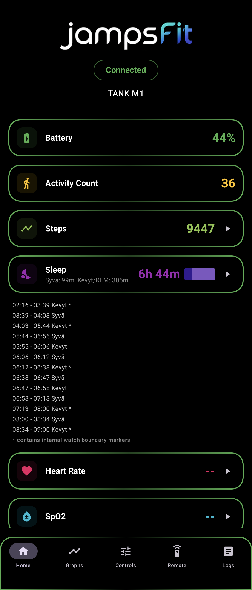

# jampsFit ⌚

A sleek, feature-rich Android companion application for the **Kospet TANK M1** smartwatch. Built with modern Android technologies (Jetpack Compose, Room, Kotlin Coroutines), this app serves as both a health dashboard and a powerful tool for reverse-engineering proprietary smartwatch protocols.

## ✨ Key Features

### 📊 Real-Time Health & Activity
- **Live Dashboard**: Monitor Battery plus live watch activity count, distance, and calories at a glance.
- **Gamified Progress**: Track daily goal progress, XP levels, step streaks, and local achievements in a dedicated Progress tab.
- **Step Fetching**: Fetch current watch-face steps manually from the Home tab or automatically at a configurable interval.
- **Sleep Tracking**: Fetch and display accurate watch sleep ranges, preserving hidden boundary markers that Da Fit may merge.
- **Dynamic Trends**: Real-time multi-line graphs for all health metrics with smooth animations and area-glow effects.
- **Health Measurements**: Track regular heart-rate measurements and receive blood pressure and SpO2 readings, with manual or phone-scheduled app-triggered blood pressure measurements.
- **Battery Intelligence**: High-resolution discharge graph and time-remaining estimation based on current usage.
- **Health Data Export**: Export your historical health and activity data to CSV files for external analysis.

### 🎮 Watch-to-Phone Remote
- **Watch Triggers**: Handles physical music buttons and the watch Shutter screen event.
- **Custom Mapping**: Configure watch buttons to control:
    - **Media**: Play/Pause, Next, Previous tracks.
    - **Volume**: Adjust system volume or toggle mute.
    - **Utility**: Toggle Flashlight, trigger Google Assistant, or take Screenshots.
- **Find My Phone**: Trigger a high-volume alarm and vibration directly from your wrist. Includes a full-screen phone overlay with a manual stop button.
- **Shutter Screen Note**: Wrist shake can emit the Shutter action when the watch is on its Shutter screen, including after the backlight has turned off; normal wrist raise outside that screen only wakes the watch display.

### 🛠️ Reverse Engineering Toolkit
- **Live Debug Log**: Full visibility into the BLE communication lifecycle (GATT operations, service discovery, notifications).
- **Unknown Packet Sniffer**: Dedicated tab for capturing and displaying unrecognized raw hex data from the watch.
- **ADB-Friendly Capture**: Watch debug logs are mirrored to Logcat under `WatchManager` for direct packet collection from a connected phone.
- **Local ADB Path**: On this workstation, use `C:\Users\ASUS\AppData\Local\Android\Sdk\platform-tools\adb.exe` for direct device/log checks.
- **Easy Export**: Long-press any log to copy captured packets to the clipboard for further analysis.
- **Controls Tab**: Connected-only watch controls, connection actions, hydrated alarm/Step goal/Auto-lock settings, display settings, notification tools, app behavior settings, and manual protocol tools.

### 🛡️ Reliability & Background Support
- **Persistent Connection**: Uses an Android Foreground Service to maintain the link even when the app is in the background or the screen is off.
- **Auto-Reconnect**: Intelligent retry logic (5 attempts with incremental delay) to recover from Bluetooth dropouts.
- **Autostart on Boot**: Optionally starts the connection service as soon as your phone finishes booting.
- **Smart Notification Mirroring**: Push phone notifications (calls, SMS, and app alerts) directly to the watch using the high-performance direct `0x41` protocol path. Includes automatic app discovery and package-name filtering.
- **Full History**: All health metrics and captured unknown packets are automatically saved to a local Room database with non-destructive migrations, ensuring graphs and logs survive app restarts.
- **Decode-First Packet Policy**: Known watch values are decoded into the app; only confirmed no-data/control chatter is filtered from Unknown captures.
- **Workout Heart-Rate Capture**: Watch exercise sessions stream live BPM through the standard heart-rate characteristic, so the Progress tab can infer duration, average BPM, BPM range, estimated steps, and estimated active calories before full workout-summary sync exists.

## 🎨 Design
- **OLED-Dark UI**: Material 3 design pinned to true black backgrounds and surfaces for watch-companion use in low light.
- **Smart Graphs**: Multi-line trends for complex data like Blood Pressure (Systolic/Diastolic) with support for both live tracking and historical review.
- **Low-Glow Surfaces**: Cards use black containers, subtle borders, and no animated shine so the app stays readable without washing out the screen.
- **Responsive**: Fully supports orientation changes without losing connection or UI state.

## 📡 Protocol & Reverse Engineering

The **Kospet TANK M1** appears to utilize the **MoYoung (DaFit)** protocol, identified through research and packet analysis:
- **Identifier**: Manufacturer identified as `MOYOUNG-V2`; behavior matches Gadgetbridge's documented Moyoung V2 protocol or a close variant.
- **Packet Structure**: Commands use at least two related formats: `FE EA 10 [LEN] [CMD]` and `FE EA 20 [LEN] [CMD]`.
- **Key Characteristics**: 
    - `0000fee2-...` / `0000fee3-...`: Legacy write/notify path. Clock sync is currently verified here.
    - `0000fee1-...` & `0000fea1-...`: Activity and health data notification channels.
    - `00006387-...` / `00006487-...`: Native MoYoung write/notify path. Present in vendor captures but not yet safe as the default send path.

Current reverse-engineering focus: passive main-screen data is restored, and the corrected `FEE2` route now has confirmed working controls for Clock Sync, Find My Watch, Alarm writes, Auto-lock, Weather forecast, and short direct `0x41` notifications. Da Fit can mirror Android notifications when it owns the watch connection, but that is only a capture clue, not a viable jampsFit feature path, because Da Fit and jampsFit cannot own the BLE link at the same time. See `PROTOCOL.md` for the active packet hypotheses and capture references.

Current stable mode: the app skips MTU negotiation, broadly subscribes to watch notification channels, and passively decodes `FEE1` live walking packets into `activityCount`, distance, and calories. Current watch-face steps are fetched from `59 00 + 59 01`, either manually from Home or automatically at the configured interval. Outbound `FEE2` commands for Clock Sync, Find My Watch, alarms, Auto-lock, time format, Quick View / wrist raise plus its active time window, Weather On, and direct `0x41` notifications up to 238 text bytes are confirmed or partly confirmed. The old Notification Probes card was removed after the remaining probes produced no useful watch behavior. Notification mirroring uses direct `0x41` by default, supports package-name filters, and can use the confirmed call packet for Android call notifications. Controls query alarms, Step goal, and Auto-lock from the watch when opened. Weather current conditions remain experimental.

Important capture correction: the Da Fit writes previously labeled as `6387` were ATT handle `0x0047`, which maps to the FEEA write characteristic `FEE2` in the captured service table. jampsFit was sending many `FE EA 20` packets to `6387`; that likely caused the reboots. The next send-path tests should route Da Fit-style `FE EA 20` packets through `FEE2`, where clock sync already works.

## 🚀 Technical Stack
- **Language**: Kotlin
- **UI**: Jetpack Compose (Material 3)
- **Database**: Room Persistence Library
- **Background**: Android Services (Foreground)
- **Communication**: Bluetooth Low Energy (BLE) / GATT
- **Concurrency**: Kotlin Coroutines & Flow
- **Build System**: Gradle (Version Catalog & KSP)
- **Known Build Warning**: The Gradle 10 deprecation warning about project dependency notation is accepted for now and should be ignored until the build tooling is upgraded.

## 📋 Roadmap
- [ ] **Gamification Expansion**: Extend the Progress-tab XP, streak, and achievement system with weekly challenges, quest cards, milestone timelines, and personal bests. See `docs/plans/GAMIFICATION-PLAN.md`.
- [ ] **Regular HR Measurements**: Add scheduled heart-rate measurement capture and history sync.
- [ ] **Additional Vitals**: Investigate scheduled blood pressure measurements and app-triggered or scheduled SpO2 support.
- [ ] **Sleep Merge Refinement**: Keep the existing accurate sleep decoding while improving how multiple sleep ranges are merged within the same day.
- [ ] **Workout Sync**: Track specific exercise sessions with GPS data.
- [ ] **Customizable Watch Faces**: Explore support for pushing custom dial files to the watch.

---
*Developed with ❤️ for the Kospet TANK M1 community.*
